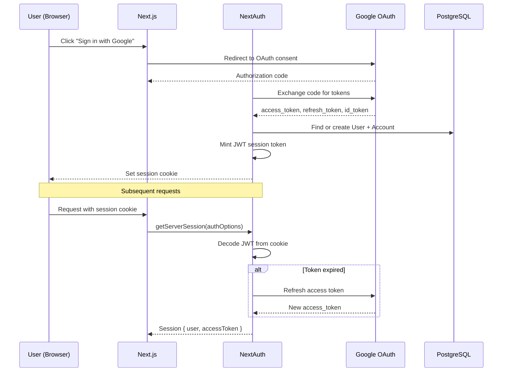
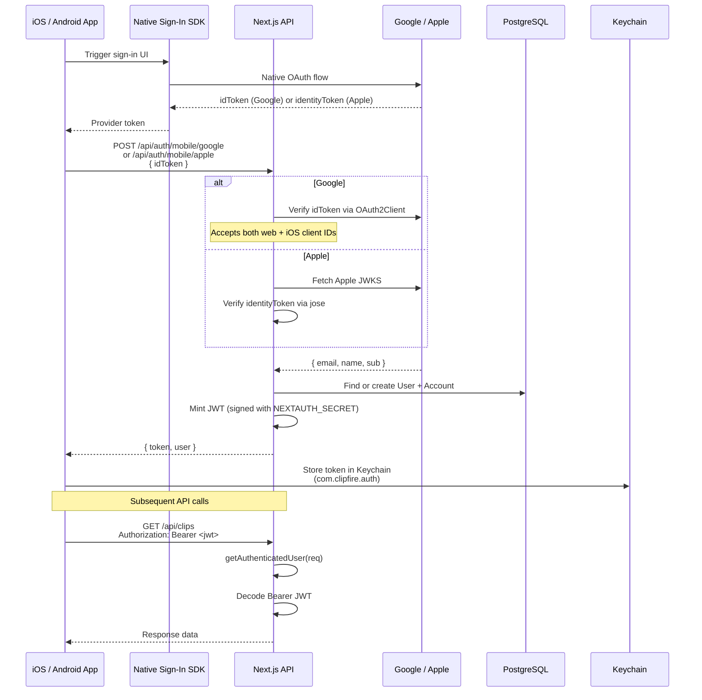
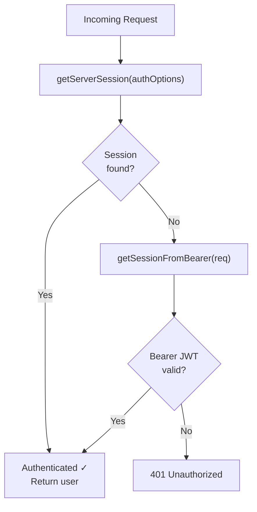

# Authentication Flow

Web (NextAuth session + JWT) and mobile (Bearer JWT) authentication.

## Web Authentication (NextAuth)

### Supported Providers

| Provider | Type        | Notes                             |
| -------- | ----------- | --------------------------------- |
| Google   | OAuth 2.0   | Primary — includes YouTube scopes |
| Facebook | OAuth 2.0   | Instagram/Pages scopes            |
| Twitter  | OAuth 1.0a  | Consumer key/secret               |
| Bluesky  | Credentials | Username/password                 |
| Dev      | Credentials | Local development only            |

### Auth Allowlist

When `AUTH_ALLOWLIST_ENABLED=true`, only emails in `AUTH_ALLOWED_EMAILS` can sign in. Checked during the `signIn` callback.

## Mobile Authentication (iOS/Android → Bearer JWT)

## Unified Auth Helper

All API routes use `getAuthenticatedUser(req)` from `shared/lib/auth-helpers.ts`:

## Key Files

| File                                      | Purpose                                   |
| ----------------------------------------- | ----------------------------------------- |
| `src/app/api/auth/[...nextauth]/route.ts` | NextAuth route handler                    |
| `shared/lib/auth.ts`                      | `authOptions`, `getSessionFromBearer()`   |
| `shared/lib/auth-helpers.ts`              | `getAuthenticatedUser()` — unified helper |
| `src/app/api/auth/mobile/google/route.ts` | Google mobile token exchange              |
| `src/app/api/auth/mobile/apple/route.ts`  | Apple mobile token exchange               |

## Environment Variables

| Variable                 | Purpose                                       |
| ------------------------ | --------------------------------------------- |
| `NEXTAUTH_SECRET`        | Signs all JWTs (web + mobile)                 |
| `NEXTAUTH_URL`           | Canonical URL for NextAuth callbacks          |
| `GOOGLE_CLIENT_ID`       | Web OAuth client ID                           |
| `GOOGLE_CLIENT_SECRET`   | Web OAuth client secret                       |
| `GOOGLE_IOS_CLIENT_ID`   | iOS Google Sign-In client ID                  |
| `APPLE_CLIENT_ID`        | Apple Sign-In service ID (`com.clipfire.app`) |
| `AUTH_ALLOWLIST_ENABLED` | Enable email allowlist gate                   |
| `AUTH_ALLOWED_EMAILS`    | Comma-separated allowed emails                |
