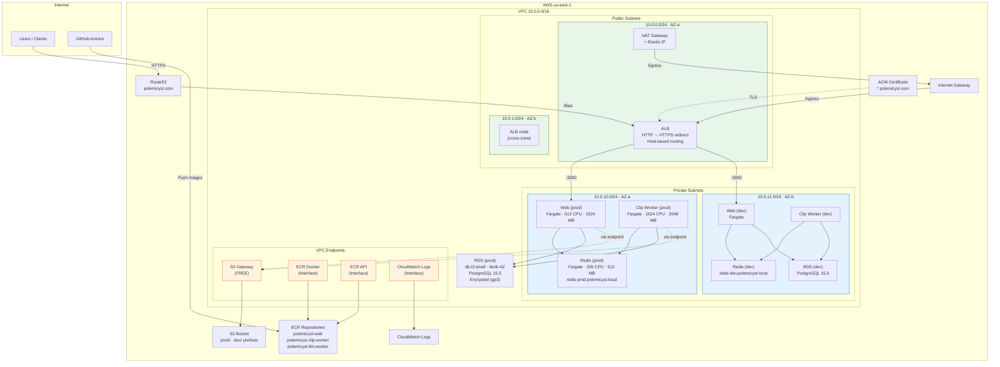
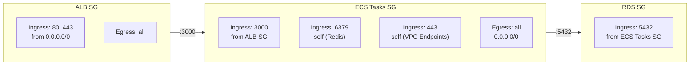

# AWS Infrastructure

VPC layout, networking, compute, storage, and database architecture.

## Network Topology

## Security Groups

## ALB Routing Rules

| Priority | Condition                                    | Target Group          | Port |
| -------- | -------------------------------------------- | --------------------- | ---- |
| —        | HTTP :80                                     | Redirect → HTTPS :443 | —    |
| 100      | Host: `polemicyst.com`, `www.polemicyst.com` | prod-web-tg           | 3000 |
| 101      | Host: `dev.polemicyst.com`                   | dev-web-tg            | 3000 |

## Service Discovery (Route53 Private DNS)

| DNS Name                      | Service      | Port |
| ----------------------------- | ------------ | ---- |
| `redis-prod.polemicyst.local` | Redis (prod) | 6379 |
| `redis-dev.polemicyst.local`  | Redis (dev)  | 6379 |

## Cost-Optimized Design

- **1 NAT Gateway** (reduced from 2) — saves ~$32/month
- **S3 Gateway Endpoint** — free, eliminates NAT data charges for S3 traffic
- **ECR/Logs Interface Endpoints** — ~$7/mo each, eliminates NAT charges for image pulls and log streaming
- **Fargate Spot** on LLM workers (provocativeness, comedic) — up to 70% savings
- See [AWS Cost Reduction](../AWS_COST_REDUCTION.md) for full analysis
