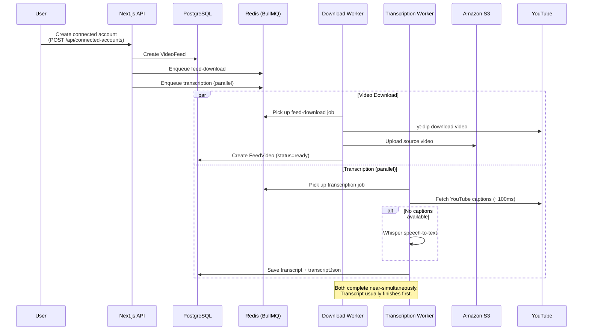
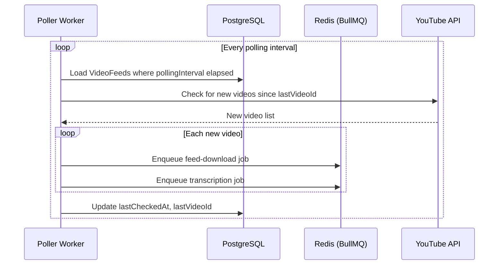

# Data Flow

End-to-end pipeline: video ingestion → transcription → scoring → clip rendering → delivery.

## Video Ingestion

## Feed Polling

## Clip Generation Pipeline

```mermaid
flowchart TB
    trigger["User clicks Generate Clips<br/>POST /api/trigger-clip"]
    quota["Check clip quota"]
    enqueue["Enqueue clip-generation job<br/>(BullMQ)"]
    pickup["Clip Worker picks up job"]

    subgraph transcribe["1. Transcription"]
        check_tx{"Transcript<br/>exists?"}
        yt_caps["YouTube captions<br/>(~100ms)"]
        whisper["Whisper STT"]
        save_tx["Save to DB"]
    end

    subgraph candidates["2. Build Candidates"]
        windows["Sliding transcript windows"]
        platform["Size by platform<br/>Reels/Shorts = short<br/>YouTube = longer"]
    end

    subgraph scoring["3. Score Candidates"]
        mode{"Scoring<br/>mode?"}
        heuristic["Heuristic (0-10)<br/>Hook + context + keywords"]
        llm["LLM Scoring (Gemini/Ollama)<br/>Council-style subscores"]
        subscores["hookScore · contextScore<br/>captionabilityScore · riskScore<br/>hasViralMoment · confidence"]
        aggregate["Aggregate with<br/>platform-tuned weights"]
        safety{"saferClips?"}
        penalty["Apply risk penalty"]
    end

    subgraph selection["4. Select Candidates"]
        sort["Sort by score desc"]
        threshold["Apply min score<br/>+ percentile filter"]
        select["Return selected segments"]
        decision["Compute hasViralMoments"]
    end

    subgraph render["5. Render Clips"]
        download["Download source from S3"]
        ffmpeg["FFmpeg: cut + captions<br/>+ aspect ratio + encode"]
        upload["Upload clip to S3"]
        create_row["Create Video row<br/>(sourceVideoId = parent)"]
    end

    subgraph track["6. Tracking"]
        cost["CostTracker.flush()<br/>→ CostEvent table"]
        training["TrainingCollector.flush()<br/>→ TrainingExample table"]
        joblog["logJob(completed)"]
    end

    trigger --> quota --> enqueue --> pickup
    pickup --> check_tx
    check_tx -->|No| yt_caps
    check_tx -->|Yes| windows
    yt_caps -->|Fail| whisper
    yt_caps -->|OK| save_tx
    whisper --> save_tx
    save_tx --> windows

    windows --> platform --> mode
    mode -->|heuristic| heuristic
    mode -->|hybrid/gemini| llm
    heuristic --> sort
    llm --> subscores --> aggregate --> safety
    safety -->|Yes| penalty --> sort
    safety -->|No| sort

    sort --> threshold --> select --> decision
    decision --> download --> ffmpeg --> upload --> create_row
    create_row --> cost --> training --> joblog
```

## Cost Tracking Stages

Each stage of the pipeline records a `CostEvent`:

| Stage           | Provider        | What's Tracked                                            |
| --------------- | --------------- | --------------------------------------------------------- |
| `download`      | s3              | File size, S3 bandwidth estimate, duration                |
| `transcription` | whisper         | Duration ($0 for local Whisper)                           |
| `llm_scoring`   | gemini / ollama | Input/output tokens, images, audio seconds, estimated USD |
| `ffmpeg_render` | ffmpeg          | Duration ($0, local compute)                              |
| `s3_upload`     | s3              | PUT + bandwidth estimate                                  |
