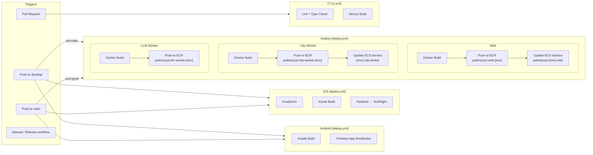
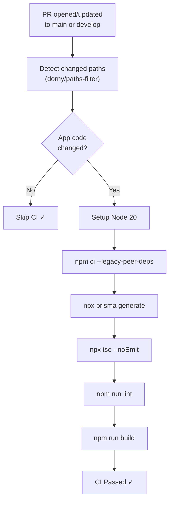
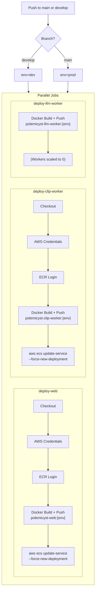
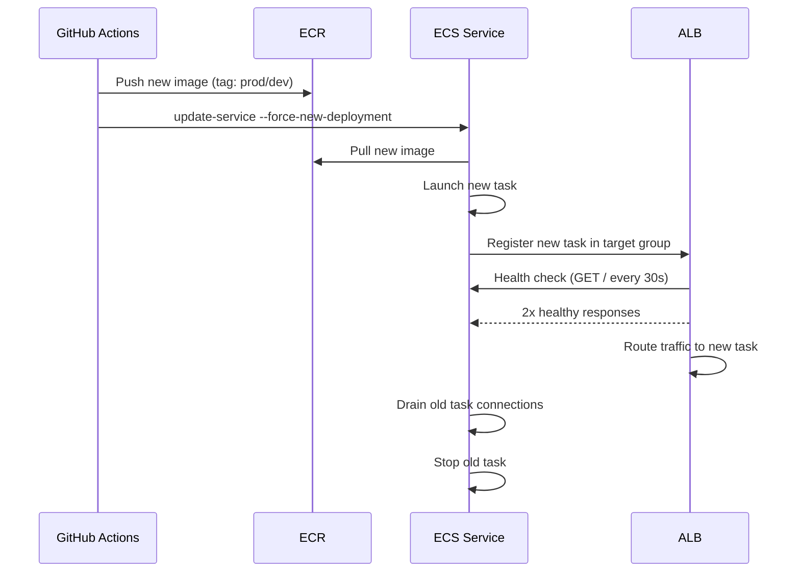
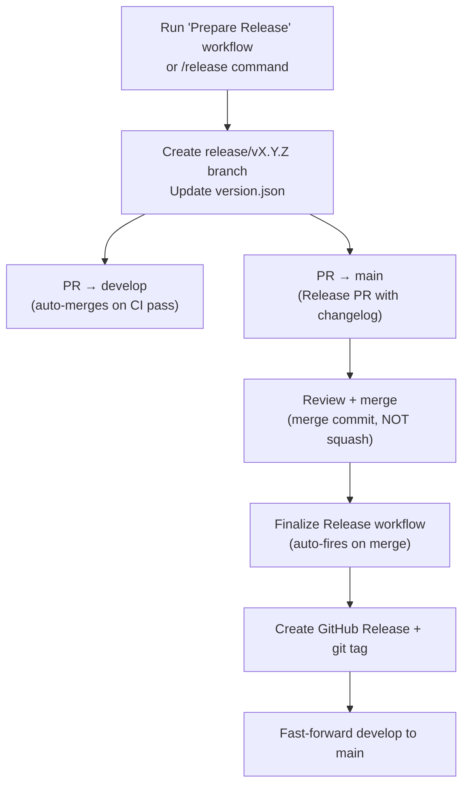

# Deployment

CI/CD pipelines for web, workers, iOS, and Android.

## Overview



## CI Pipeline (Pull Requests)



## Deploy Pipeline (Push to main/develop)

Runs three jobs in parallel:



## ECS Rolling Deployment



## iOS Deployment

| Stage              | Tool                     | Target                                      |
| ------------------ | ------------------------ | ------------------------------------------- |
| Project generation | XcodeGen (`project.yml`) | `Clipfire.xcodeproj`                        |
| Build              | Xcode (xcodebuild)       | `ClipfireApp` scheme                        |
| Sign               | Fastlane Match           | App Store Distribution cert                 |
| Upload             | Fastlane Pilot           | TestFlight (dev) / App Store Connect (prod) |

**Runner:** `macos-15`
**Bundle ID:** `com.clipfire.app`
**Team ID:** `L6AS5GG2MB`

## Android Deployment

| Stage             | Tool                      | Target           |
| ----------------- | ------------------------- | ---------------- |
| Build             | Gradle                    | APK / AAB        |
| Distribute (dev)  | Firebase App Distribution | Internal testers |
| Distribute (prod) | Play Store Console        | Production       |

**Runner:** `ubuntu-latest`

## Release Process



## Branch Strategy

```
main ← production deployments, tagged releases
  ↑
develop ← integration branch, dev deployments
  ↑
feature/* / fix/* / chore/* ← work branches (PR → develop)
```

## Environment Variables

Stored as GitHub Secrets (repo-level):

| Category | Secrets                                                        |
| -------- | -------------------------------------------------------------- |
| AWS      | `AWS_ACCESS_KEY_ID`, `AWS_SECRET_ACCESS_KEY`                   |
| Database | `DATABASE_URL_PROD`, `DATABASE_URL_DEV`                        |
| Auth     | `NEXTAUTH_SECRET`, `GOOGLE_CLIENT_ID`, `GOOGLE_CLIENT_SECRET`  |
| iOS      | `MATCH_PASSWORD`, `APP_STORE_CONNECT_API_KEY`, `APPLE_TEAM_ID` |
| Android  | `FIREBASE_APP_ID`, `FIREBASE_TOKEN`                            |
