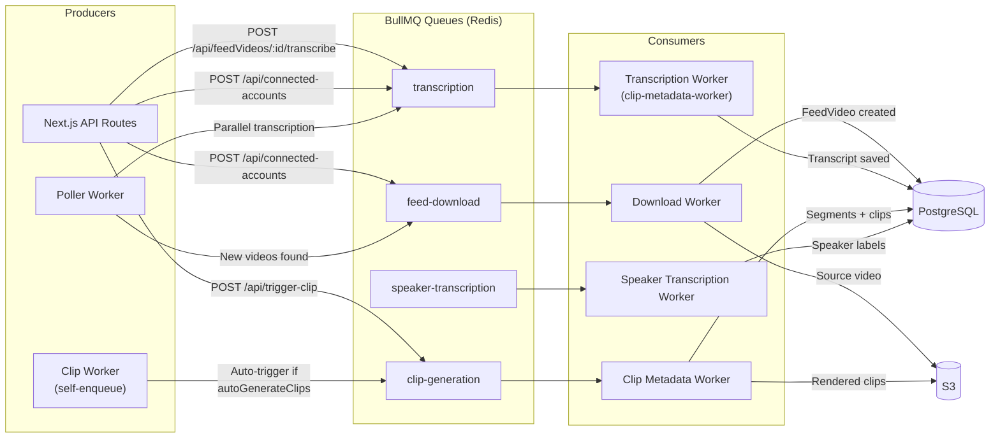
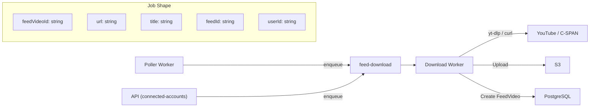
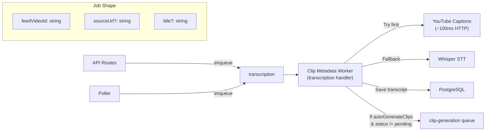
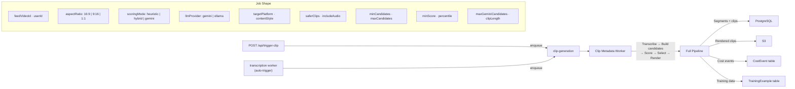
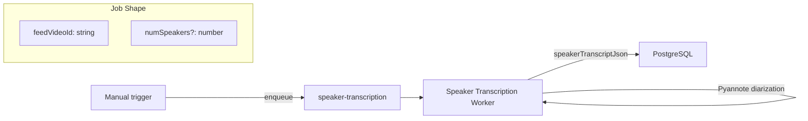

# Queue Architecture

BullMQ queue topology — all queues are backed by Redis (ECS Fargate, service-discovered at `redis-{env}.polemicyst.local:6379`).

## Queue Topology



## Queue Details

### `feed-download`

Downloads source videos from external platforms.



**Config:** `removeOnComplete: true`, `removeOnFail: true`

### `transcription`

Converts video audio to text. Runs in parallel with download for YouTube imports.



**Dedup:** `jobId: feedVideoId` prevents duplicate transcription jobs.

**Status gate:** Auto-trigger only fires when `feedVideo.status !== 'pending'` (prevents premature triggering during parallel imports).

### `clip-generation`

The main processing pipeline — scoring, selection, rendering.



### `speaker-transcription`

Speaker diarization (identifies who is speaking when).



## Retry & Error Handling

| Queue                   | Max Retries | Backoff     | On Failure                       |
| ----------------------- | ----------- | ----------- | -------------------------------- |
| `feed-download`         | 3           | Exponential | Mark FeedVideo status=failed     |
| `transcription`         | 3           | Exponential | Log error, skip auto-trigger     |
| `clip-generation`       | 2           | Exponential | Mark clipGenerationStatus=failed |
| `speaker-transcription` | 2           | Exponential | Log error                        |

All queues use `removeOnComplete: true` and `removeOnFail: true` to avoid unbounded Redis memory growth.

## Job Logging

Every queue records lifecycle events in the `JobLog` table:

```
queued → started → completed | failed
```

Each entry captures: `jobType`, `status`, `durationMs`, `errorMessage`, `metadata` (JSON).

Admin dashboard: `/admin/logs`
