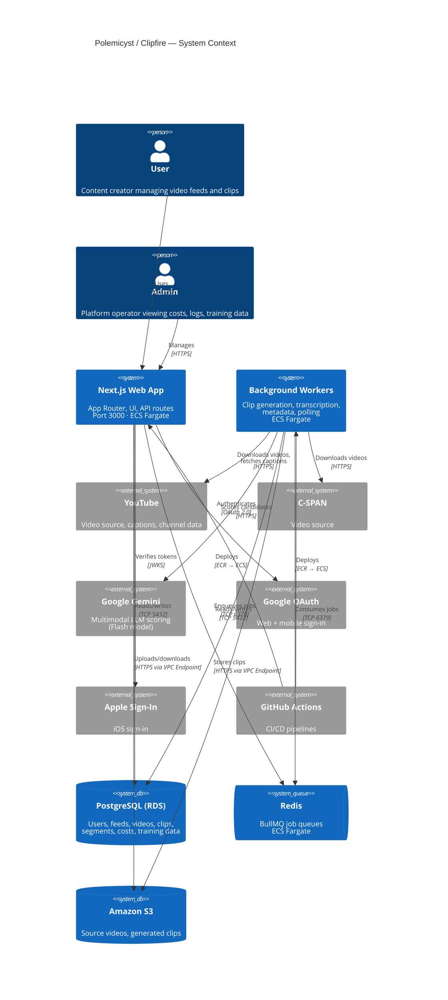

# System Overview

C4 Context diagram showing all major systems and their interactions.

## Component Summary

| Component     | Technology                | Hosting                   | Purpose                           |
| ------------- | ------------------------- | ------------------------- | --------------------------------- |
| Web App       | Next.js 14 (App Router)   | ECS Fargate               | UI, API routes, auth              |
| Clip Worker   | Node.js + FFmpeg + yt-dlp | ECS Fargate               | Transcription, scoring, rendering |
| Poller Worker | Node.js                   | Docker (dev)              | Feed polling, video discovery     |
| PostgreSQL    | PostgreSQL 15.5           | RDS (prod) / Docker (dev) | Primary datastore                 |
| Redis         | Redis Alpine              | ECS Fargate               | BullMQ queue backend              |
| S3            | Amazon S3                 | AWS                       | Video and clip storage            |
| Gemini        | Google Gemini Flash       | Google Cloud              | Multimodal LLM scoring            |
| Ollama        | Ollama (local)            | Docker sidecar            | Free LLM alternative (dev/future) |
